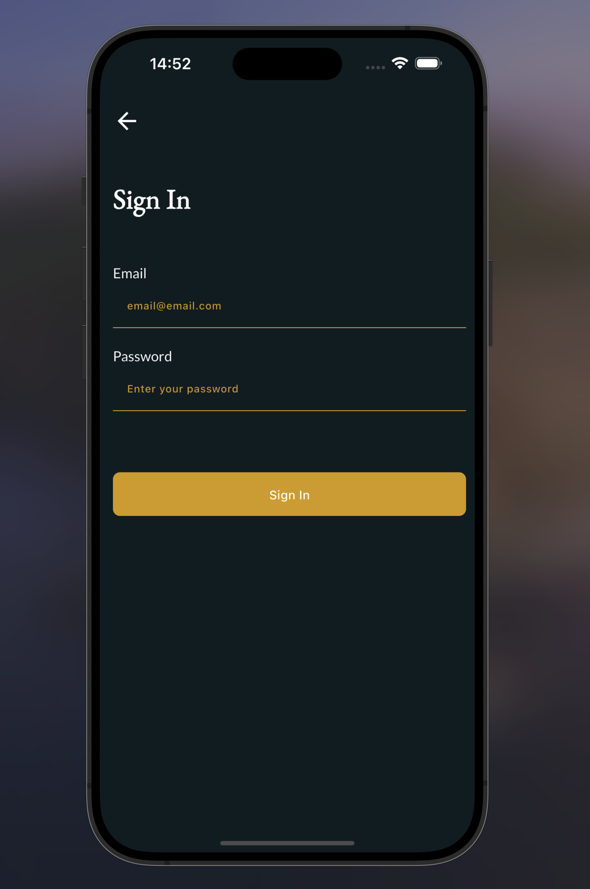

# pixelfield

# Project Documentation

## Design
[Figma Design Link](https://www.figma.com/file/gX69tW4YfXMvlGrYVu2l7Q/Untitled?node-id=0%3A1&t=F0MrdQ0b8gYMilE6-1)

## Requirements
- Use the latest stable Flutter version.
- Implement null-safety.
- Utilize mockup JSON files for data instead of a REST API.
- Ensure data connection is available only when an internet connection is present.
- Store data within the app and implement a refresh mechanism after fetching if data exists.
- Provide a solution for offline functionality, allowing for future filtering (e.g., "offline" set).
- Adopt the BLoC pattern for state management.
- Use Git for version control; share the link upon completion.

## Additional Information
- Any packages from [pub.dev](https://pub.dev/) can be used, but justification for their use is required.
- Time tracking on the task is necessary, and this information should be sent.
- If any changes to templates are desired, provide details and rationale for the preferred approach.
- It is not mandatory to create all templates, but the application's flow must be demonstrated (at least "My collection" and "Details" are required).
- Animations are welcome but not required.

## Package Justification

- `google_fonts`: Used for easily integrating Google Fonts into the application, enhancing UI aesthetics.
- `go_router`: Utilized for declarative routing in Flutter, providing a robust and flexible navigation solution.
- `font_awesome_flutter`: Provides a wide range of customizable icons, improving the visual appeal and usability of the UI.
- `cupertino_icons`: Standard Apple-style icons for iOS-specific UI elements.
- `connectivity_plus`: Checks for internet connectivity, addressing the requirement for connection availability only when online.
- `shimmer`: Implements shimmer loading effects, providing a better user experience during data loading.
- `flutter_bloc`: Essential for implementing the BLoC (Business Logic Component) pattern for state management, as required.
- `equatable`: Used with BLoC to simplify equality comparisons of objects, reducing boilerplate code for state classes.

## Project Screenshots

  
  
  

  
  
  

  
  
  

  
  
  

  
  

